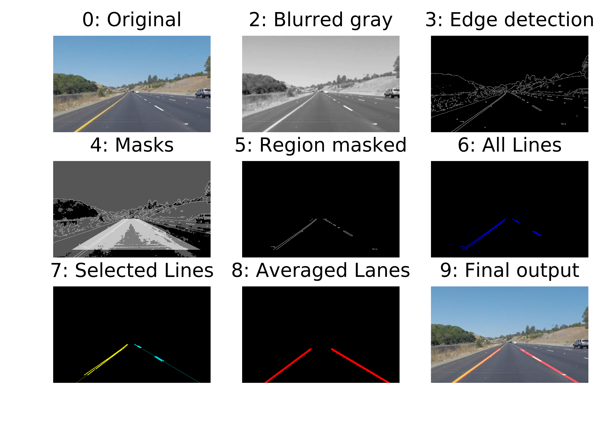
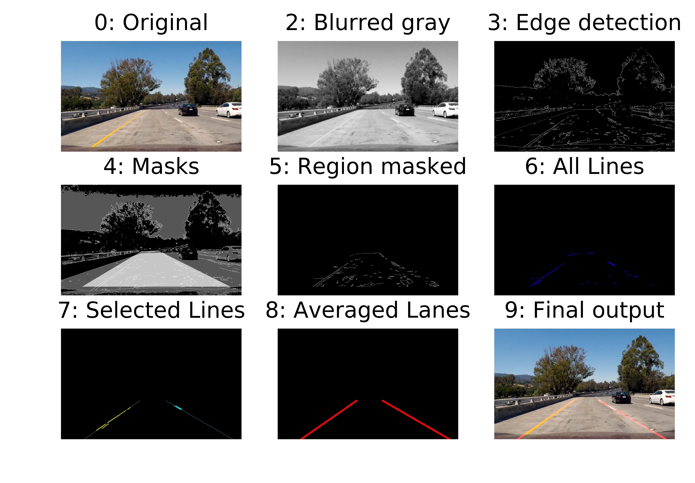
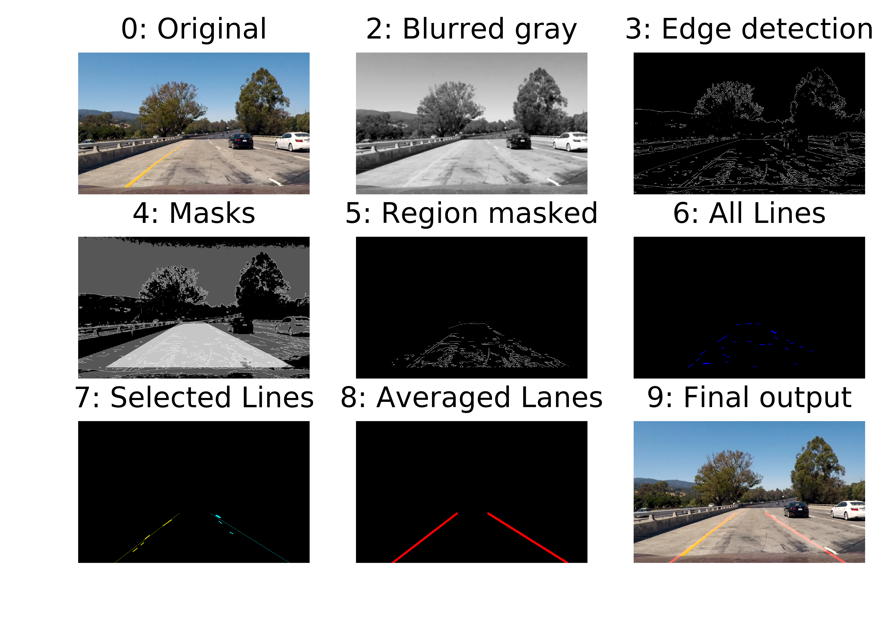

**Finding Lane Lines on the Road**

The goals / steps of this project are the following:
* Make a pipeline that finds lane lines on the road, the pipeline will expect one color image frame and outputs

### 1. Description of the pipeline - 

My pipeline consists of the following steps - 

1. Convert the image to grayscale
2. Blur the grayscale image to detect only the prominant edge features in the image
3. Apply Canny edge detection to the blurred gray image
4. Create masks that enable us to select edges that are more likely to be lane lines. 
	a. Region based mask allows us to enable selection of the pixels from the area of interest - This is shown as the lighter gray region in the image
	b. Color based mask allows us to select potential pixels from the image that can be lane lines -This is shown as the darker gray region in the image
5. Output of Canny edge detection masked with the region based and color based masks
6. Lines fitted to the edges using Hough Transform, image depicts all the lines that were detected
7. Sort lines into left or right lane lines and filter out the lines that do not look like lane lines based on its slope and intercept values, to select only the liness that are most potentially lane lines
8. All the potential left lane lines are averaged and all the potential right lane lines are averaged to calculate the best prediction of the respective lane lines
9. To create the final output image the original image is superimposed with the calculated lane line features

Following is the pictorial description of the pipeline working on the project video. Note step 1 output is missing, which would be the grayscale image, step 2 depicted is the blurred gray image.

### 2. Identify potential shortcomings with your current pipeline

Here are some of the shortcomings of this approach - 
1. Fitting lane lines to a line instead of a curve, approach will inherently have noise on curved roads and may not work well on really tight curves
2. Sorting of lines to left or right lane lines assumes that there is only one lane line visible in the region selected, fitering from all lines to probable lane lines (step 7) will not work when vehicle is changing lanes or if the orientation of the vehicle is significantly different from the orientation of the lane

### 3. Possible improvements to the pipeline

1. Currently, the pipeline is using a fixed polygon to calculate the region of interest to look for the lane lines. It would be good to update the polygon that we look at based on out knowledge of the camera perspective and also if we can update based on offset of the car from the lanes.

2. Another potential improvement could be to filter the lane position over multiple image frames as we do not expect the lane lines to change rapidly from one image to another in the video. 

3. Also, for images where we do not detect any potential lines for either left or right line, currently no line is drawn in the output image. We can update the pipeline to use the last known value for that respective lane line.

For the following images collected from the challenge video, the selection of lane lines from all possible lines works well most of the times. For example -

However, it can use more accurate lane line selection from all possible lines and from the above mentioned improvements for situations like - 

